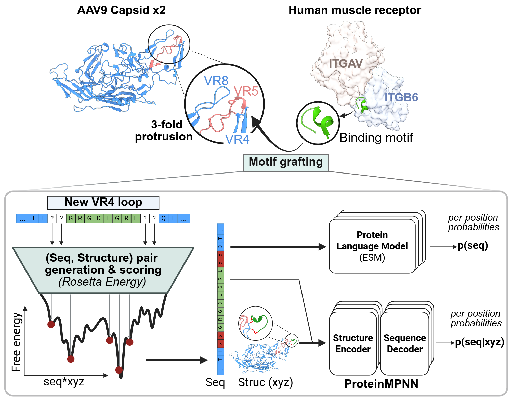

# Functional Motif Grafting into AAV Capsid Protein

Scripts for running the design and analysis described in the manuscript. 
<p align="center">
  
</p>

## Motif grafting by RosettaRemodel

The commands to graft human aVb6 binding motifs (4um9, 5ffo, and 5nem) into AAV9 capsid can be found in the [`./Rosetta_Design_VR4/AAV9_[motif]`](Rosetta_Design_VR4) directory. To design, run the bash file in each sub-folder, which will generate maximum 5 best designs (sequence+structure) in `./Rosetta_Design_VR4/AAV9_[motif]/output_design`. In the manuscript, we generated ~550-750 such designed sequence-structure pairs for each binding motif, then scored them by p(seq) (ESM2) and p(seq|structure) (ProteinMPNN) to select the best sequences for experimental validation.
```bash
bash ./Rosetta_Design_VR4/AAV9_[motif]/run_design_[motif].sh
```

# Scoring the Rosetta outputs by ESM2 and ProteinMPNN

The notebooks to score the (sequence, structure) pairs generated from RosettaRemodel can be found in the [`./notebook_ESM2_MPNN/`](notebook_ESM2_MPNN) directory. The notebooks require `torch`, [`esm2`](https://github.com/facebookresearch/esm), and [`ProteinMPNN`](https://github.com/dauparas/ProteinMPNN). To install, run the following commands:

```bash
conda create -n esm2 python=3.10
conda activate esm2
pip install torch==2.7 torchvision torchaudio --index-url https://download.pytorch.org/whl/cu118
pip install fair-esm
git clone https://github.com/dauparas/ProteinMPNN.git
```